# Internal Network Penetration Testing
---
## For VirtualInfosecAfrica

###### Submitted By:
###### Jason Abeiku Boateng Techie

###  Table of Content
* ##### Executive Summary
* ##### Analysis of Overall Security 
* ##### Testing Methodologies
* ##### Summary Of findings
    * Host Discovery
    * Subdomain Enumeration
    * Service Discovery and Port Scanning
    * Vulnerability Associatedd With Service versions
    * Vulnerability Scanning and Analysis
    * Web-based Attack Surfaces
* ##### CVSS V3.0 referrence table

##### Executive Summary
Virtualinfosecafrica conducted an internal network penetration test of in scope **IPs** and **domain**  provided by the companies networking department. This reports describes the penetration methodologies and snap shot of findings accociated to the scope during the testing.

Out of the scope provided, 15 IPs were found to be live running different services. From the version assessments there were a total of five findings - one critical,three high and one medium. The critical risk-finding could allow a remote authenticated attacker to take full remote control of the host operating system. The other three vulnerabilities with high risk were associated with remote code execution and privelge escalation. The medium risk vulnerabilities was associated with Denial of Service(DOS) attacks.

##### Analysis of Overall Security

The company's overall security risk is HIGH.This assessment is made based on the risk impact associated with the vulnerabilities. These vulnerabilites could allow privelege escalation, remote code execution as well as Denial Of Service.
This could allow a malicious attacker have access to company customer data, business information thus invading privacy as well as cause system breakdown leaving company unable to function.

##### Testing Methodology

Testing began by scanning the in-scope ips provided using various scanning tools to discover which hosts were online.Afer scanning the scope IP to find live hosts, a subdomain enumeration was performed on the domain provided by the company for further analysis.
After discovering whic hosts were live, services running on the various ports were identified through service and port scannings.Service scan was necessary as it gave way to detect vulnerabilities associated with ports of specific hosts.
Protocol specific targets were created by grouping IPs that were running common services.
Using the services running on variuos ports, vulnerabilities associated with these services were discovered using exploitdb as well as the MITRE CVE as guides to determine the severity of each vulnerability using their associated CVSS.
Test scans were performed on protocol specific hosts to identify any login vulnerability using common credentials and wordlists. Custom wordlists were generated to further test for login vulerabilities. Using automation tools, screenshots were taken from ips that run web services to inspect further.
Payloads were written for hosts that run on apache tomcat server(java based) as well as python to further exploit the discovered vulnerabilities.

##### Summary of Findings
* ###### Host Discovery
  From the scope provided,host discovery was performed using nmap and fifteen hosts were found to be live.
  
  **nmap 10.10.10.0/24 | grep -i "nmap scan report" >> hosts**
  

* ###### Subdomain Enumeration
    Using the domain name provided,subdomain and assiciated IPs were discovered using *aiodnsbrute*.Six subdomains with their ips were found.
    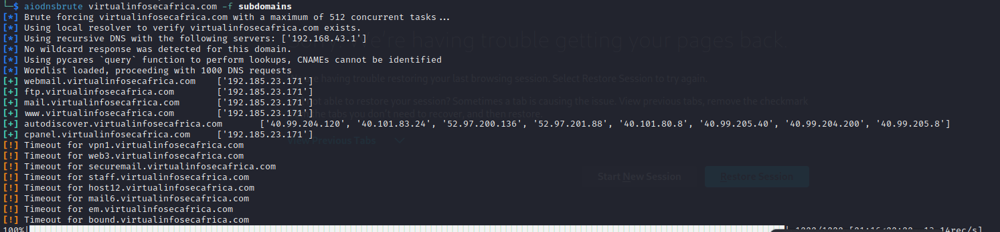

* ###### Service and Port Scanning
  With the live hosts discovered, futher scans were performed on them to find more information about their open ports and services each port is running.
  
  **nmap -iL hosts -sV -T4 -oG nmap_scan_report.txt**
  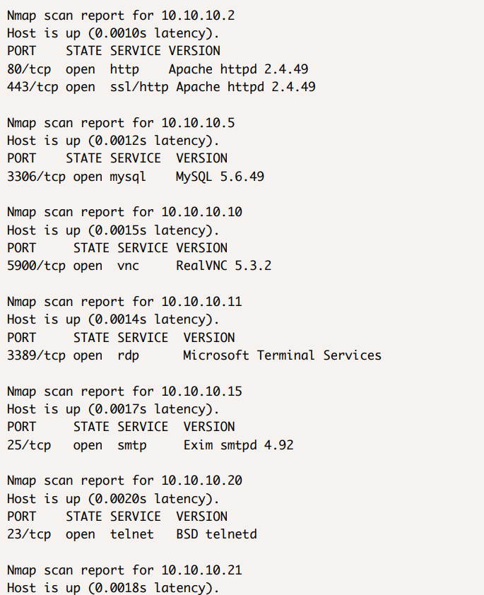
  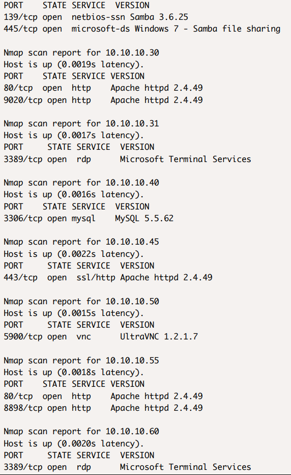
  
  **commands for creating host specific targets**
  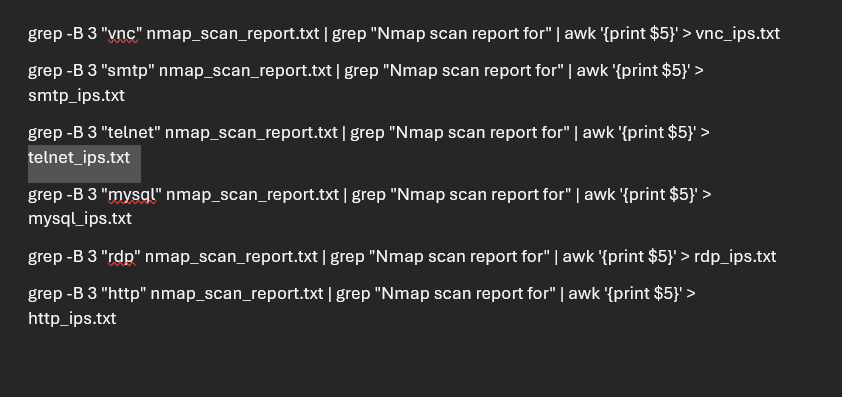

* ###### Vulnerability Associated with service versions
   * **HTTP service running Apache service**
        A vulnerability in Apache HTTP Server 2.4.49's path normalization allows an attacker to perform a path traversal attack, accessing files outside the intended directories. If these files aren't protected by the default "require all denied" configuration, the attacker can successfully access them. If CGI scripts are enabled in these aliased paths, the attack could escalate to remote code execution.
        
    **Recomendations:**
        Upgrade Apachce

  *  **Microsoft Terminal Service**
     An elevation of privilege vulnerability exists in Microsoft Windows when folder redirection has been enabled. An attacker who is successfully able to exploit this vulnerability can gain acess to user's personal data.
     **Recommendation**
     This vulnerability can be addressed by reconfiguring Folder redirection with offline files and also restricting permissions
     
     **Referenc:**
     https://www.cve.org/CVERecord?id=CVE-2021-26887
     https://www.exploit-db.com/exploits/18606
    **Evidence:**
     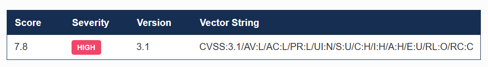

  *  **Mysql**
    Success attacks on this vulnerability can result in unauthorized ability to cause a Denial of Service capable of crashing the server.
    
    **Evidenc**
    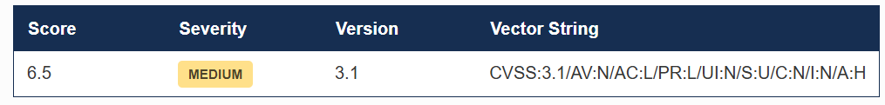

  * **RealVnc**
    Exploitation of related vulnerability allows an attacker to create users with elevated privileges via HTTP requests.
    
    **Reference:**
    https://cve.mitre.org/cgi-bin/cvekey.cgi?keyword=RealVNC+5.3.2
    **Evidence:**
    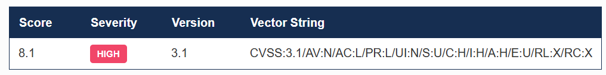

  * **UltraVnc**
    Desktop server for windows use hard-coded credentials for its UltraVnc installation. Successfully exploiting this could allow a remote authenticated attacker to take full remote control of the host operating system
    
    **Reference**
    https://www.cve.org/CVERecord?id=CVE-2022-25246
    **Evidence:**
    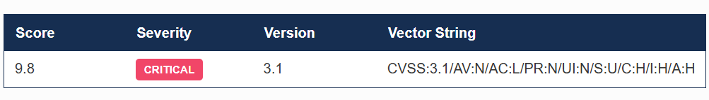

  * **Exit smtpd**
  This vulnerability allows remote attackers to execute arbituary code on affected installations of Exim.Authentication is not associated with this vulnerability.This results from imporper validation from user-supplied data.
  
  **Reference:**
  https://www.cve.org/CVERecord?id=CVE-2023-42117
  **Evidence:**
  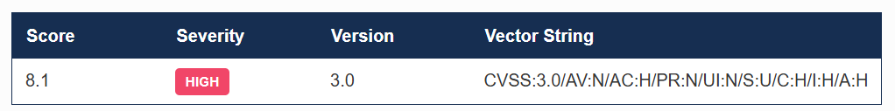

###### Vulnerability Scanning
Using metasploit to identify login vulnerabilities.
   * Mysql login Vulnerabilities
    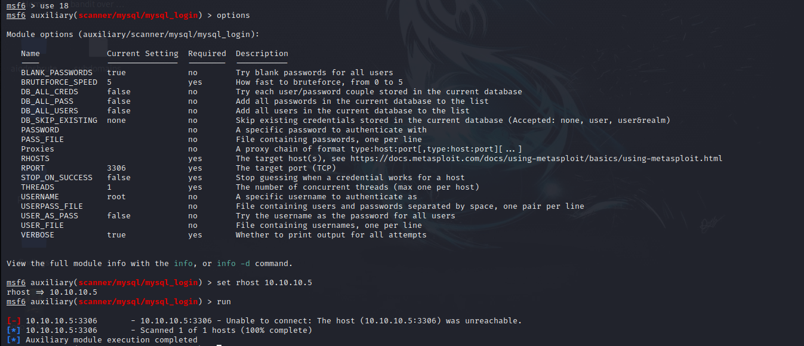
   * Vnc login vulnerabilities
    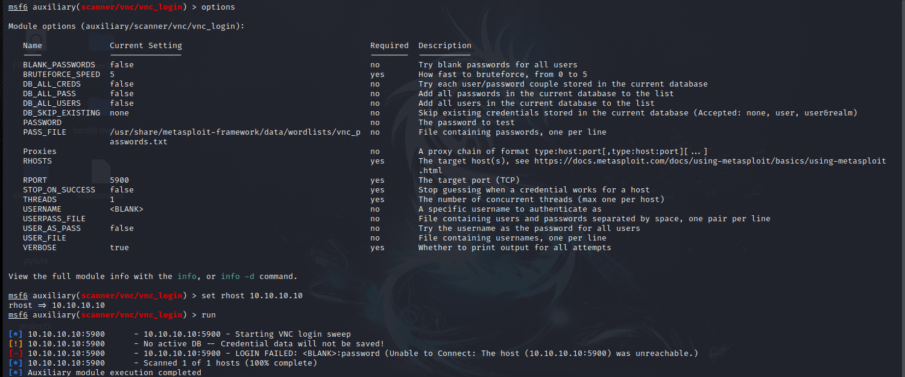
   * Smb login vulnerabilities
    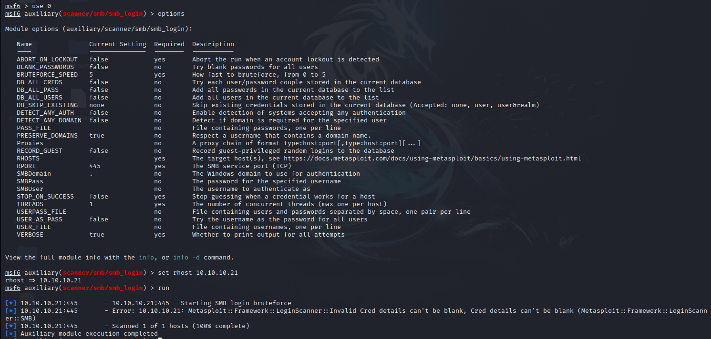
   * Rdp login vulnerability
   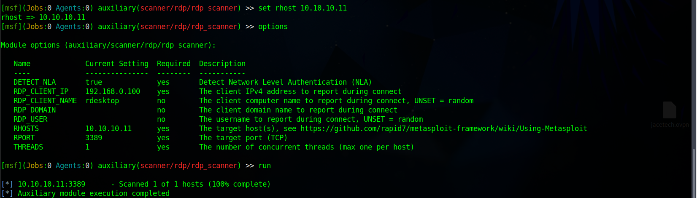

**Generating custom wordlists**
Custom wordlists can be generated to allow password cracking through brute forcing as well as fuzzing to test web servers.This can be done using cewl to crawl over websited.
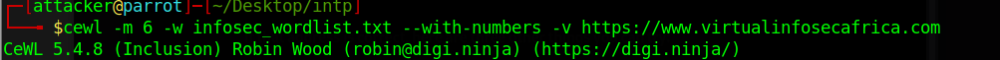

##### Web based Attack Surfaces
  * **Using eyewitness to find more information about pages**
     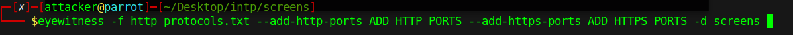
     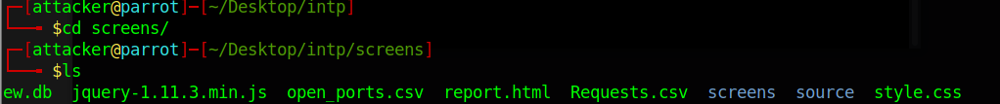
    **findings**
    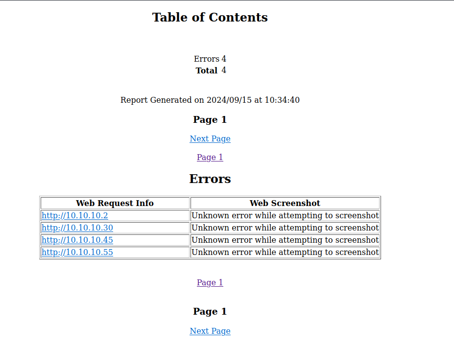
  * **Gnenerating payloads for hosts running on servers**
    * Payload for Apache Tomcat(JAVA Based)
        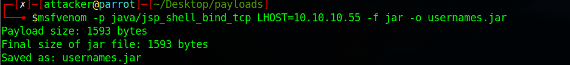
        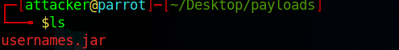
    * Payload for python server
        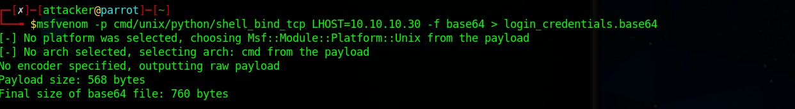
        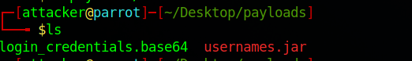

###### CVSS V3.0 referrence table
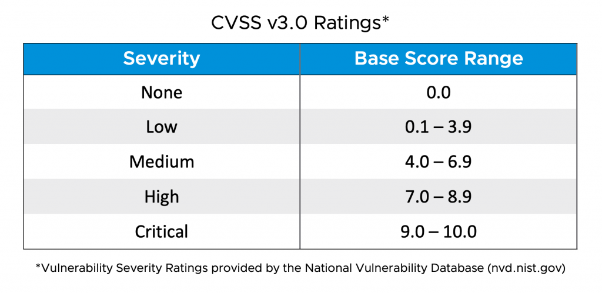 
     https://nvd.nist.gov/vuln-metrics/cvss
